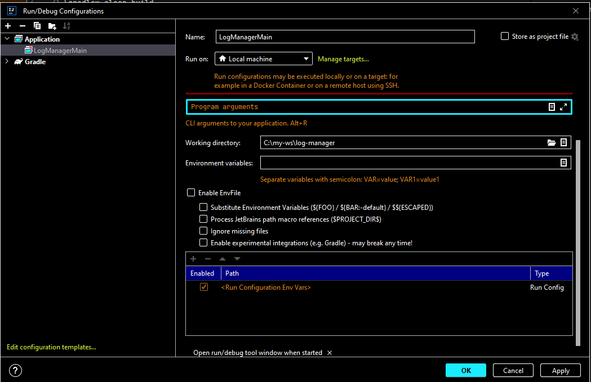
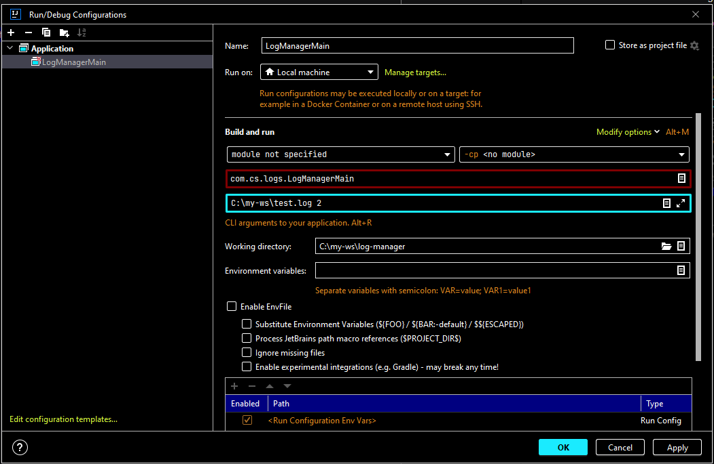

Log-manager is gradle project

Run below command to build and test

.\gradlew clean build

With the help of editor like Intellij, this program can be run with runtime arguments or without runtime arguments
For example below are the steps to follow in Intellij

Post build the program can be executed in build folder from terminal
java -jar .\build\libs\log-manager-1.0-SNAPSHOT.jar <location of log file> <number of threads>
e.g. java -jar .\build\libs\log-manager-1.0-SNAPSHOT.jar C:\my-ws\log-manager\src\main\resources\test.log 1
